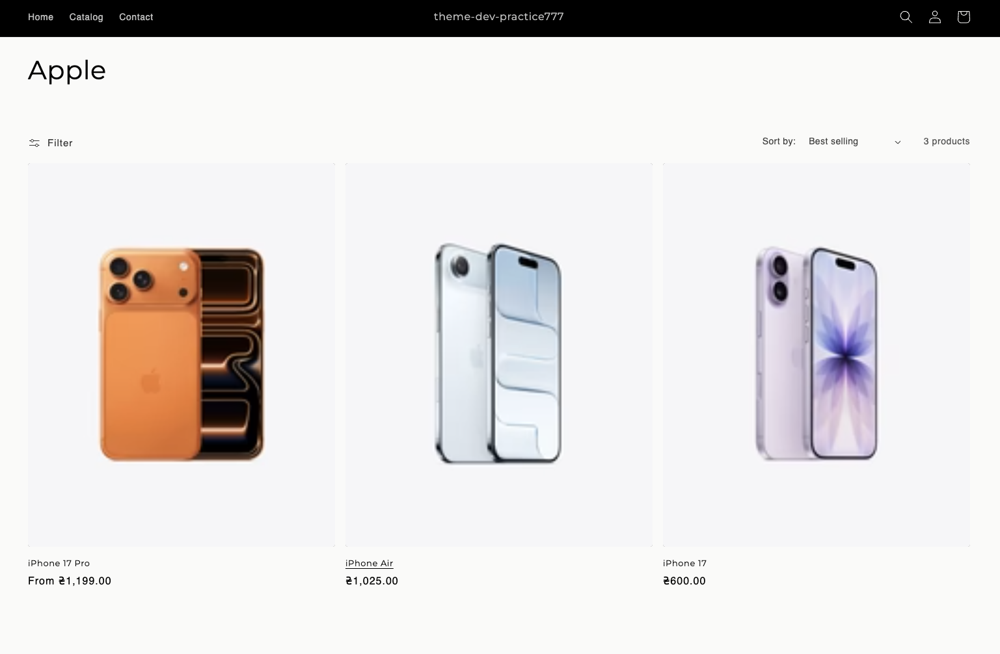
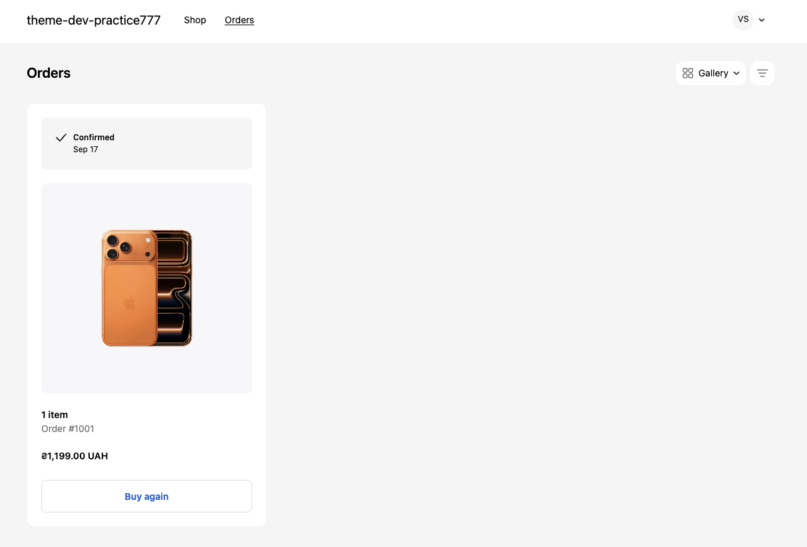

# TEST

run server - shopify theme dev -e development

update page - shopify theme push -e development

## Практична робота

1. Додав нові продукти до каталогу

2. Додав продуктам опції з вибору кольору та пам'яті

3. Протестував оформлення замовлення

4. Протестував оплату замовлення

5. Залив дату з новими продуктами через файл CSV

6. Додав їм фото

